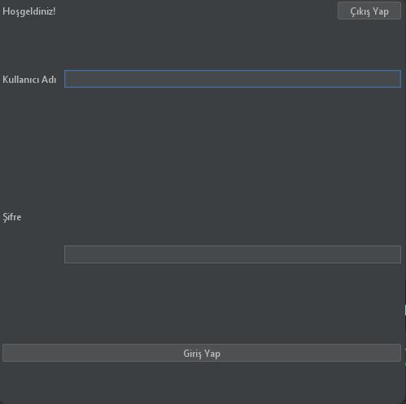
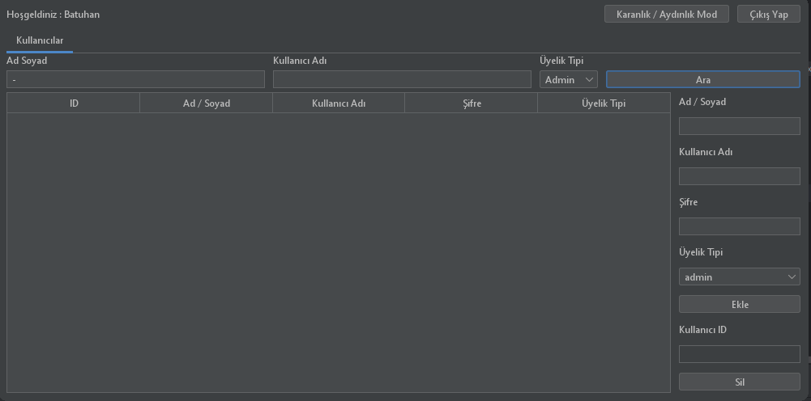
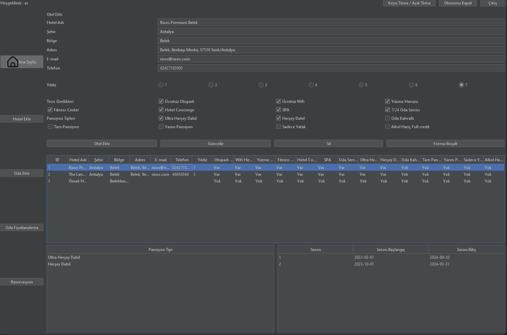
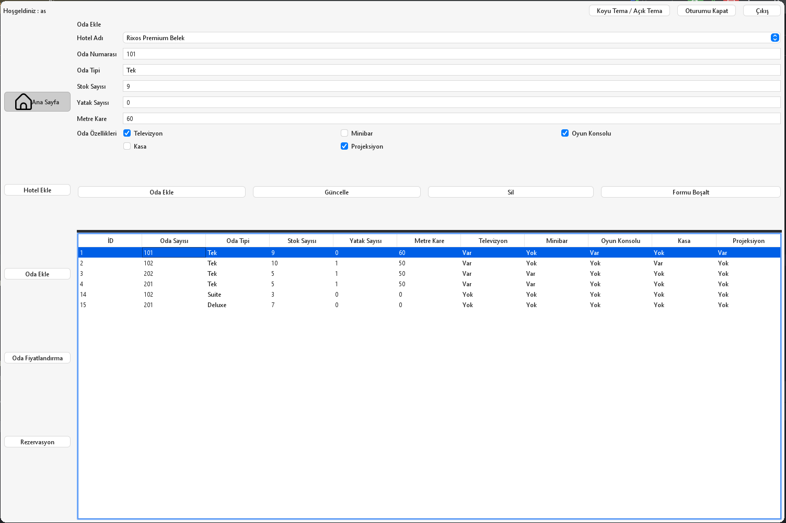
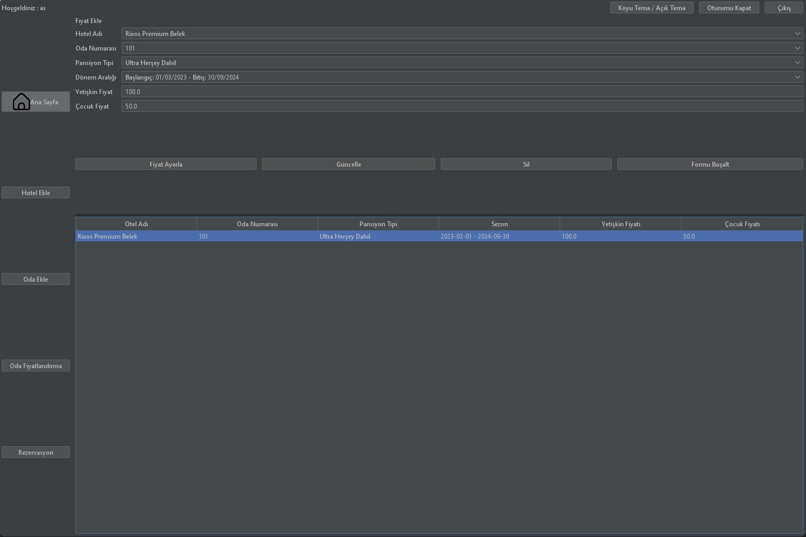
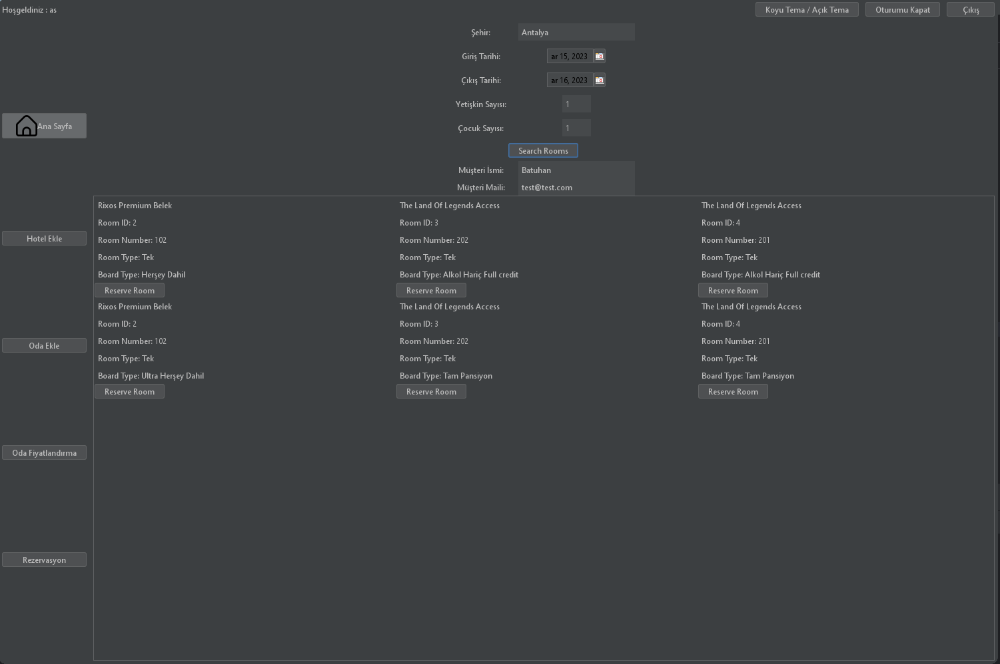

# Hotel Management Project

## Introduction
Bu proje, otel yönetimi için geliştirilmiş bir sistemdir.
Hotel Management Project, otel işletmelerinin günlük operasyonlarını
etkin bir şekilde yönetmeyi hedefleyen kapsamlı bir yazılım çözümüdür. 
Bu projenin amacı, otel sahiplerine ve yöneticilerine müşteri rezervasyonları, 
odaların durumu, fiyatlandırma, ve genel otel işleyişi konusunda güçlü bir kontrol sağlamaktır.

NOT : GELİŞTİME SÜRECİ DEVAM ETMEKTEDİR.

### NOT : LÜTFEN PROJEMDE BULUNAN SQL DOSYASINI KULLANIN YOKSA SORUNLAR OLUŞABİLİR!

## Featured features:
- Otel sahipleri ve yöneticileri için güçlü bir kontrol paneli
- Dinamik Fiyatlandırma: Oda fiyatlarını belirleyen dinamik bir sistemle, oteller rekabet avantajı sağlayabilir.
- Otel Yönetimi: Otel yöneticileri, otel odalarının durumunu, müşteri rezervasyonlarını, fiyatlandırmayı ve diğer işlemleri kolayca yönetebilir.
- Rezervasyon Yönetimi: Müşteri rezervasyonlarını takip etmek ve yönetmek için kullanıcı dostu bir arayüz.
- Otel Özellikleri: Otelin sunduğu özelliklerin detaylı bir şekilde izlenmesi ve güncellenmesi.
- Otel Odaları: Otel odalarının durumunun izlenmesi ve güncellenmesi.
- Otel Fiyatlandırma: Otel odalarının fiyatlarının izlenmesi ve güncellenmesi.

## Proje Görselleri

*Login ekranı*



*Admin ekranı*



*Otel ekleme*



*Oda ekleme*



*Oda fiyatlandırma*



*Dinamik rezervasyon*



## Proje Geliştirme Aşamaları

- [x] Proje için gerekli olan veritabanı tablolarının oluşturulması
- [x] Veritabanı tabloları için gerekli olan verilerin eklenmesi
- [x] Kullanıcı Arayüzü Tasarımı
- [x] Dinamik Panel Güncellemeleri: Kullanıcıdan gelen dinamik verilere daha hızlı ve etkili bir şekilde tepki verebilmek için dinamik panellerin güncellenmesi
- [ ] Performans Optimizasyonu
- [ ] Test ve Hata Ayıklama
- [ ] Dokümantasyon Güncellemeleri
- [ ] Yenilikçi Özellikler
- [ ] Topluluk Geri Bildirimleri
- [ ] Kullanıcı Eğitimi: Projeyi kullanan kullanıcılar için eğitim materyalleri


# Tables

## Board Type Table

### Table Creation
```sql
CREATE TABLE `board_types`(
    `id`              int(11) NOT NULL,
    `board_type_name` varchar(255) NOT NULL,
    PRIMARY KEY (`id`)
) ENGINE=InnoDB DEFAULT CHARSET=utf8mb4 COLLATE=utf8mb4_general_ci;
```
### Sample Data Insertion for Hotel Table
```sql
INSERT INTO `board_types` (`id`, `board_type_name`)
VALUES (1, 'Ultra Herşey Dahil'),
       (2, 'Herşey Dahil'),
       (3, 'Oda Kahvaltı'),
       (4, 'Tam Pansiyon'),
       (5, 'Yarım Pansiyon'),
       (6, 'Sadece Yatak'),
       (7, 'Alkol Hariç Full credit')

```

## Hotel Table

### Table Creation
```sql
CREATE TABLE `hotels` (
  `id` int(11) NOT NULL,
  `name` varchar(255) NOT NULL,
  `city` varchar(100) NOT NULL,
  `region` varchar(100) DEFAULT NULL,
  `address` text DEFAULT NULL,
  `email` varchar(100) DEFAULT NULL,
  `phone` varchar(20) DEFAULT NULL,
  `star` varchar(11) DEFAULT NULL,
  `freePark` tinyint(1) NOT NULL,
  `freeWifi` tinyint(1) NOT NULL,
  `swimmingPool` tinyint(1) NOT NULL,
  `fitnessCenter` tinyint(1) NOT NULL,
  `hotelConcierge` tinyint(1) NOT NULL,
  `spa` tinyint(1) NOT NULL,
  `roomService` tinyint(1) NOT NULL,
  `ultraAllInclusive` tinyint(1) NOT NULL,
  `allInclusive` tinyint(1) NOT NULL,
  `bedAndBreakfast` tinyint(1) NOT NULL,
  `fullBoard` tinyint(1) NOT NULL,
  `halfBoard` tinyint(1) NOT NULL,
  `roomOnly` tinyint(1) NOT NULL,
  `nonAlcoholFull` tinyint(1) NOT NULL,
   PRIMARY KEY (`id`) 
) ENGINE=InnoDB DEFAULT CHARSET=utf8mb4 COLLATE=utf8mb4_general_ci;
```
### Sample Data Insertion for Hotel Table
```sql
INSERT INTO `hotels` (`id`, `name`, `city`, `region`, `address`, `email`, `phone`, `star`, `freePark`, `freeWifi`, `swimmingPool`, `fitnessCenter`, `hotelConcierge`, `spa`, `roomService`, `ultraAllInclusive`, `allInclusive`, `bedAndBreakfast`, `fullBoard`, `halfBoard`, `roomOnly`, `nonAlcoholFull`) VALUES
(1, 'Rixos Premium Belek - The Land Of Legends Access', 'Antalya', 'Belek', 'Belek, Ileribaşı Mevkii, 07500 Serik/Antalya', 'rixos@rixos.com', '02427102000', '7', 1, 1, 1, 1, 1, 1, 1, 1, 1, 0, 0, 0, 0, 0),
(2, 'The Land Of Legends Access', 'Antalya', 'Belek', 'Belek, Ileribaşı Mevkii, 07500 Serik/Antalya', 'rixos.com', '46656564', '3', 1, 1, 1, 1, 1, 1, 1, 1, 1, 0, 0, 0, 0, 0),
```
## Hotel Board Types Table

### Table Creation
```sql
CREATE TABLE `hotel_boardtypes`
(
    `id`            int(11) NOT NULL,
    `hotel_id`      int(11) DEFAULT NULL,
    `board_type_id` int(11) NOT NULL,
     PRIMARY KEY (`id`),
     FOREIGN KEY (`hotel_id`) REFERENCES `hotels` (`id`) ON DELETE CASCADE ON UPDATE CASCADE,
     FOREIGN KEY (`board_type_id`) REFERENCES `board_types` (`id`) ON DELETE CASCADE ON UPDATE CASCADE
) ENGINE=InnoDB DEFAULT CHARSET=utf8mb4 COLLATE=utf8mb4_general_ci;
```
### Sample Data Insertion for Room Table
```sql
INSERT INTO `hotel_boardtypes` (`id`, `hotel_id`, `board_type_id`)
VALUES (1, 1, 1),
       (2, 1, 2),
       (3, 2, 7),
       (4, 2, 4),
```
## Periods Table

### Table Creation
```sql
CREATE TABLE `periods`
(
    `period_id`  int(11) NOT NULL,
    `hotel_id`   int(11) DEFAULT NULL,
    `start_date` date NOT NULL,
    `end_date`   date NOT NULL,
    PRIMARY KEY (`period_id`),
    CONSTRAINT `periods_ibfk_1` FOREIGN KEY (`hotel_id`) REFERENCES `hotels` (`id`) ON DELETE CASCADE ON UPDATE CASCADE
) ENGINE=InnoDB DEFAULT CHARSET=utf8mb4 COLLATE=utf8mb4_general_ci;

```
### Sample Data Insertion for Room Table
```sql
INSERT INTO `periods` (`period_id`, `hotel_id`, `start_date`, `end_date`)
VALUES (1, 1, '2023-03-01', '2024-09-30'),
       (2, 1, '2023-10-01', '2024-03-31'),
       (3, 2, '2023-11-01', '2023-11-16'),
       (4, 2, '2023-11-01', '2023-11-16'),

```
## Room Table

### Table Creation
```sql
CREATE TABLE `rooms`
(
    `id`             int(11) NOT NULL,
    `hotel_id`       int(11) DEFAULT NULL,
    `room_number`    varchar(100) NOT NULL,
    `room_type`      varchar(50) DEFAULT NULL,
    `stock_quantity` int(11) NOT NULL,
    `bed_quantity`   int(11) NOT NULL,
    `meter_square`   int(11) NOT NULL,
    `television`     tinyint(1) NOT NULL,
    `minibar`        tinyint(1) NOT NULL,
    `game_console`   tinyint(1) NOT NULL,
    `safe`           tinyint(1) NOT NULL,
    `projection`     tinyint(1) NOT NULL,
    `board_type_id`  int(11) DEFAULT NULL,
    PRIMARY KEY (`id`),
    KEY `rooms_ibfk_1` (`hotel_id`),
    KEY `rooms_ibfk_2` (`board_type_id`),
    CONSTRAINT `rooms_ibfk_1` FOREIGN KEY (`hotel_id`) REFERENCES `hotels` (`id`) ON DELETE CASCADE ON UPDATE CASCADE,
    CONSTRAINT `rooms_ibfk_2` FOREIGN KEY (`board_type_id`) REFERENCES `board_types` (`id`) ON DELETE CASCADE ON UPDATE CASCADE
) ENGINE=InnoDB DEFAULT CHARSET=utf8mb4 COLLATE=utf8mb4_general_ci;
```
### Sample Data Insertion for Room Table
```sql
INSERT INTO `rooms` (`id`, `hotel_id`, `room_number`, `room_type`, `stock_quantity`, `bed_quantity`, `meter_square`,
                     `television`, `minibar`, `game_console`, `safe`, `projection`, `board_type_id`)
VALUES (1, 1, '101', 'Tek', 9, 0, 60, 1, 0, 1, 0, 1, 1),
       (2, 1, '102', 'Tek', 10, 1, 50, 1, 0, 0, 1, 0, 2),
```
## Price List Table

### Table Creation
```sql
CREATE TABLE `pricelist`
(
    `id`            int(11) NOT NULL,
    `room_id`       int(11) DEFAULT NULL,
    `board_type_id` int(11) DEFAULT NULL,
    `period_id`     int(11) DEFAULT NULL,
    `adult_price`   decimal(10, 2) DEFAULT NULL,
    `child_price`   decimal(10, 2) DEFAULT NULL,
    PRIMARY KEY (`id`),
    FOREIGN KEY (`room_id`) REFERENCES `rooms` (`id`) ON DELETE CASCADE ON UPDATE CASCADE,
    FOREIGN KEY (`board_type_id`) REFERENCES `board_types` (`id`) ON DELETE CASCADE ON UPDATE CASCADE,
    FOREIGN KEY (`period_id`) REFERENCES `periods` (`period_id`) ON DELETE CASCADE ON UPDATE CASCADE
) ENGINE=InnoDB DEFAULT CHARSET=utf8mb4 COLLATE=utf8mb4_general_ci;

```
### Sample Data Insertion for Room Table
```sql
INSERT INTO `pricelist` (`id`, `room_id`, `board_type_id`, `period_id`, `adult_price`, `child_price`)
VALUES (29, 1, 5, 5, 100.00, 50.00),
       (30, 1, 1, 1, 100.00, 50.00);
```

## Reservation Table

### Table Creation
```sql
CREATE TABLE `reservations`
(
    `id`             int(11) NOT NULL,
    `hotel_id`       int(11) DEFAULT NULL,
    `room_id`        int(11) DEFAULT NULL,
    `start_date`     date           NOT NULL,
    `end_date`       date           NOT NULL,
    `customer_name`  varchar(100)   NOT NULL,
    `customer_email` varchar(100)   NOT NULL,
    `total_price`    decimal(10, 2) NOT NULL,
    PRIMARY KEY (`id`),
    KEY `reservations_ibfk_1` (`hotel_id`),
    KEY `reservations_ibfk_2` (`room_id`),
    CONSTRAINT `reservations_ibfk_1` FOREIGN KEY (`hotel_id`) REFERENCES `hotels` (`id`) ON DELETE CASCADE ON UPDATE CASCADE,
    CONSTRAINT `reservations_ibfk_2` FOREIGN KEY (`room_id`) REFERENCES `rooms` (`id`) ON DELETE CASCADE ON UPDATE CASCADE
) ENGINE=InnoDB DEFAULT CHARSET=utf8mb4 COLLATE=utf8mb4_general_ci;
```
### Sample Data Insertion for Room Table
```sql
INSERT INTO `reservations` (`id`, `hotel_id`, `room_id`, `start_date`, `end_date`, `customer_name`, `customer_email`, `total_price`) VALUES
(NULL, NULL, NULL, '2023-03-13', '2023-03-16', 'tyfhfght', 'gfhjghfj', 450.00);
```
## User Table

### Table Creation
```sql
CREATE TABLE `user`
(
    `id`    int(11) NOT NULL,
    `name`  varchar(50)  NOT NULL,
    `uname` varchar(50)  NOT NULL,
    `pass`  varchar(255) NOT NULL,
    `type`  varchar(50)  NOT NULL
) ENGINE=InnoDB DEFAULT CHARSET=utf8mb4 COLLATE=utf8mb4_general_ci;

```
### Sample Data Insertion for Room Table
```sql
INSERT INTO `user` (`id`, `name`, `uname`, `pass`, `type`)
VALUES (1, 'Batuhan', 'batu', '1234', 'Admin'),
       (2, 'Ahmen', 'ahmet0', '2134', 'User');
```

