# Hotel Management Project

## Readme in Other Languages :books:

- :tr: [Türkçe](README.md)
- :uk: [English](README_EN.md)

## Technology Stack

<p align="center">
    
</p>


## Introduction
This project is a system developed for hotel management. The Hotel Management Project is a comprehensive software solution aimed at effectively managing the daily operations of hotel businesses. The goal of this project is to provide hotel owners and managers with robust control over customer reservations, room status, pricing, and overall hotel operations.

NOTE: THE DEVELOPMENT PROCESS IS ONGOING.

This project is an extensive JDBC learning project. The project primarily focuses on a login system, providing separate management screens for employees and administrators.

### Project Overview

- **Login System:** Separate management interfaces for employees and administrators.

- **Employee Section:**
    - Ability to add hotels with customizable seasonal date ranges and meal plans for each hotel.
    - Detailed room addition functionality allowing different types and quantities of rooms to be added to hotels.
    - Room pricing section for detailed pricing based on associated meal plans, seasonal ranges, and room types.
    - Reservation functionality enabling the listing of available rooms based on city and guest count, allowing room bookings.
    - Automatic price calculation upon reservation, decreasing room inventory upon booking.
    - Dashboard presenting graphical representations such as pie charts displaying room type availability, reservation counts, profits, and a reservation table for registered hotels.
- **Admin Section:**
    - User management for all registered users.
- **User Interface:**
    - Emphasis on a user-friendly interface, featuring a toggle switch for light and dark themes, providing day and night mode options.
- **Technology Stack:**
    - Java, JDBC for database connectivity.
    - Utilization of MySQL and phpMyAdmin for database management.
    - IntelliJ IDEA as the IDE.
    - JavaSwing for the user interface.
    - Maven for dependency management.
    - Git for version control.
    - GitHub for project hosting.

## How to Use

1. Clone or download the project files.
2. Upload the MySQL database file to your phpMyAdmin server.
3. Open the project with a Java IDE (such as IntelliJ IDEA, Eclipse, etc.).
4. After opening the project files in the IDE, locate and run the `LoginGUI.java` file.

### Note on Themes

You can switch between light and dark themes using the toggle button for different interface experiences.

This project has extensively utilized MySQL and phpMyAdmin for database management.

Feel free to explore and provide any feedback or suggestions!


## Project Screenshots

*Login Interface*

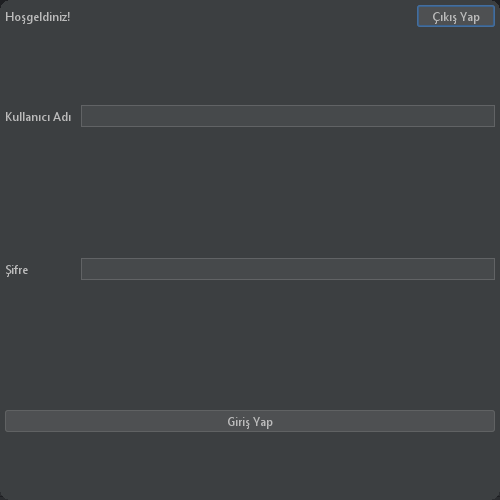

*Landing Page*

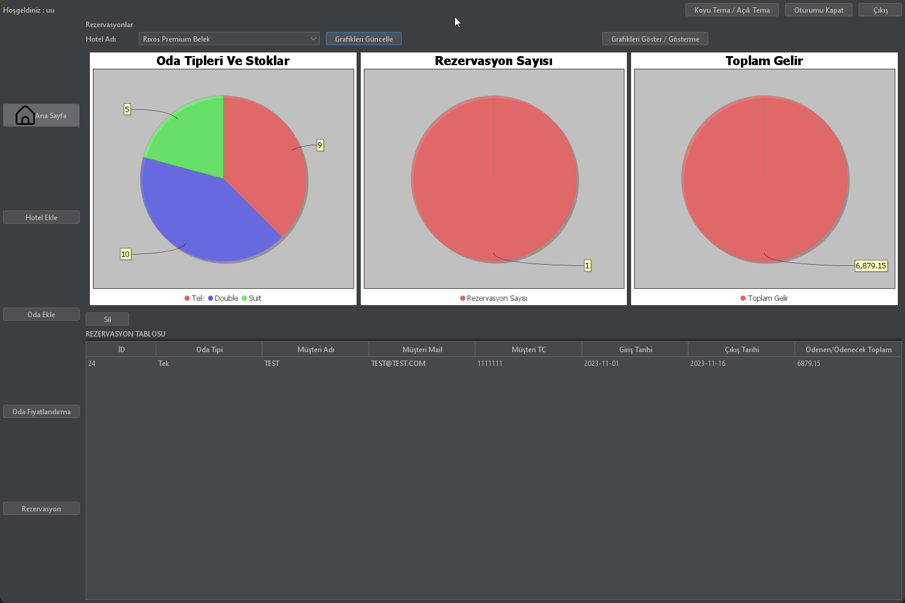 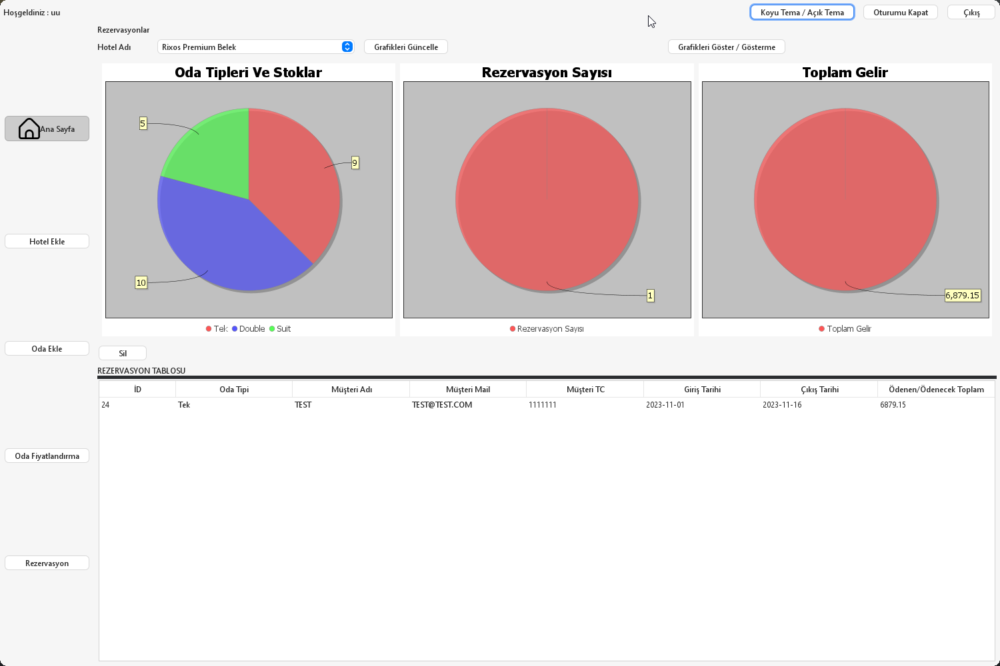

*Admin Panel*

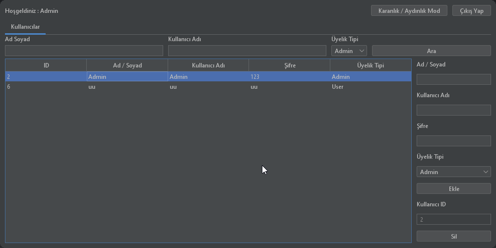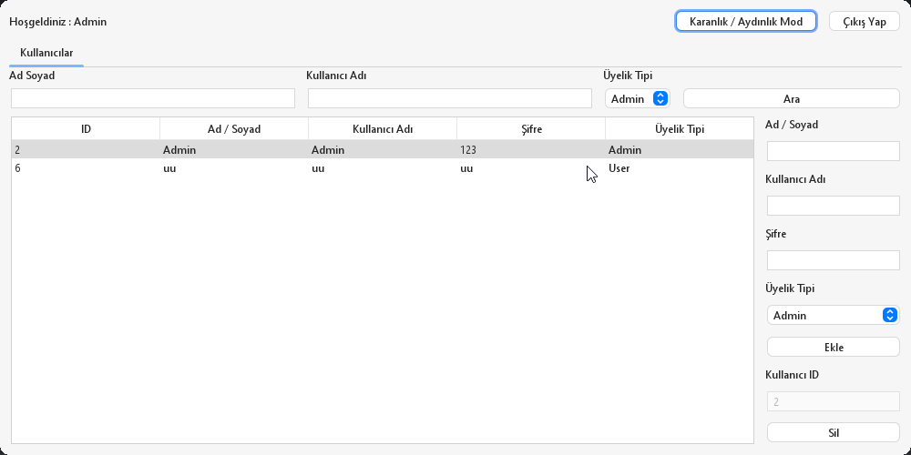

*Hotel Panel*

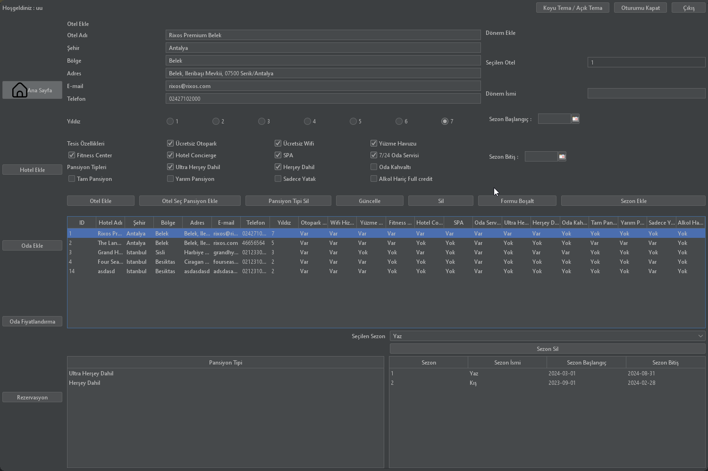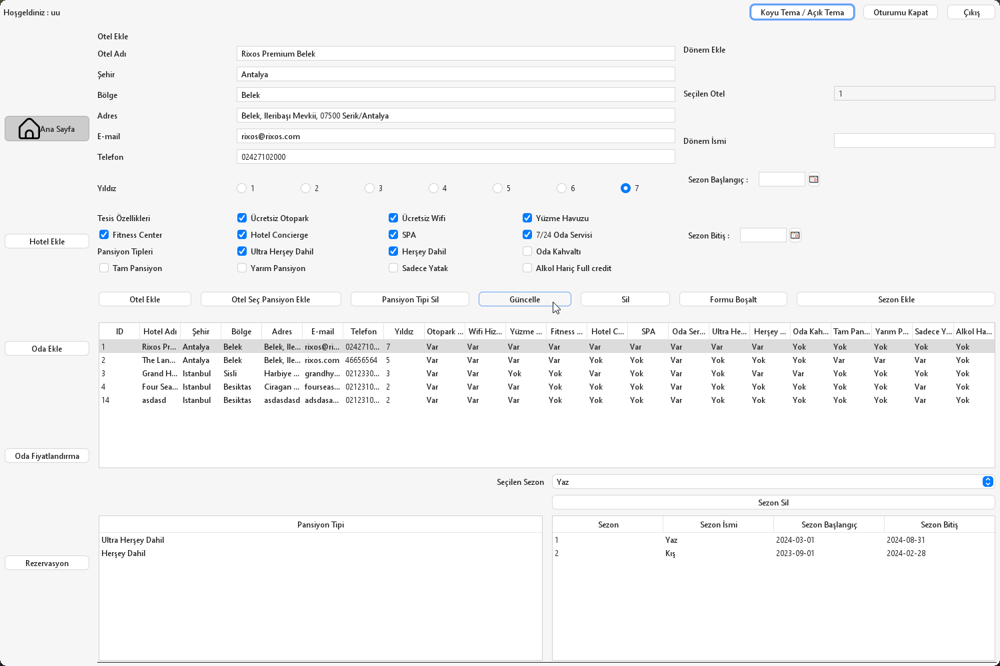

*Room Panel*

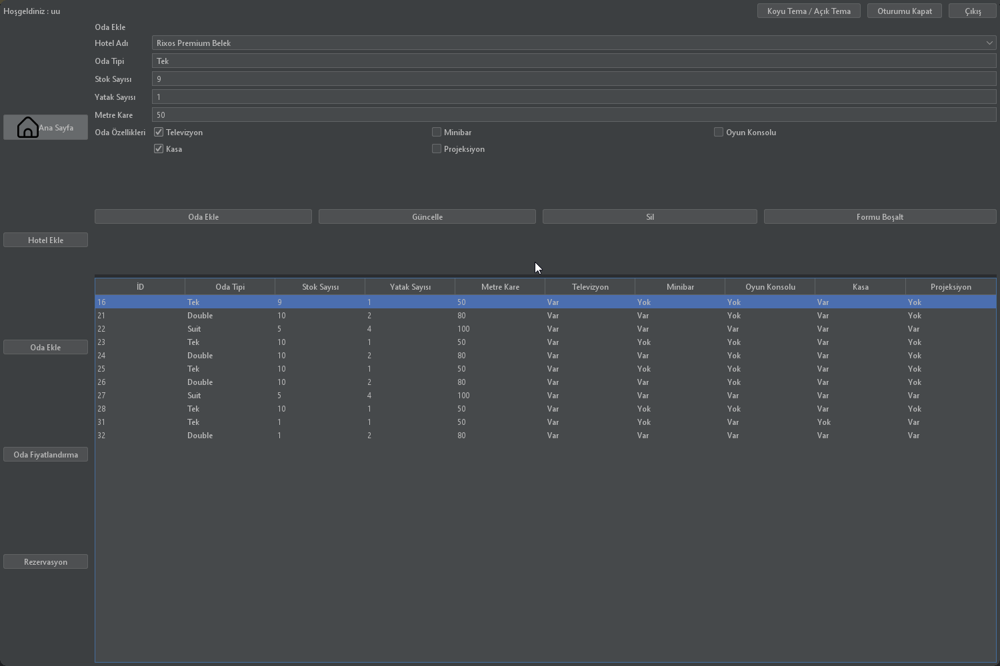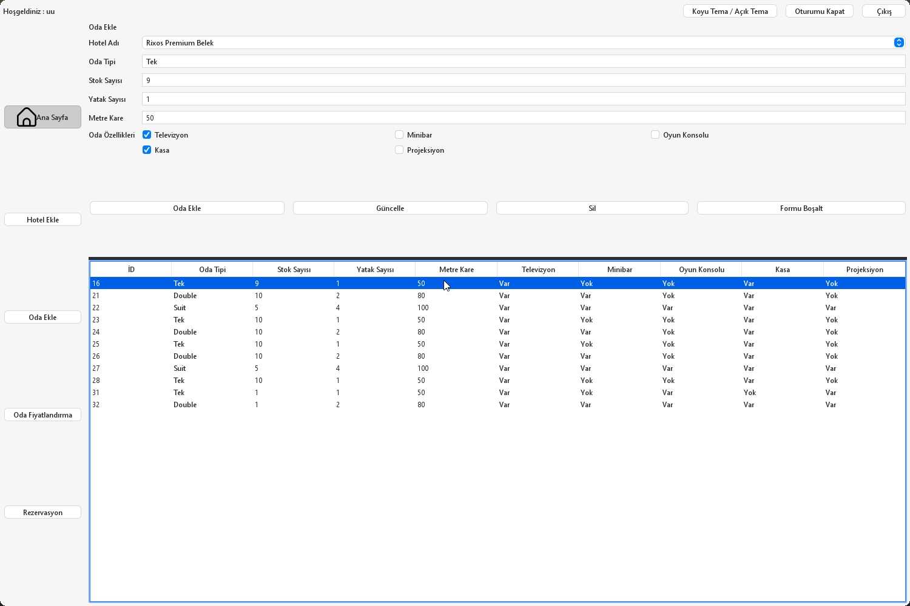

*Room Prices Panel*

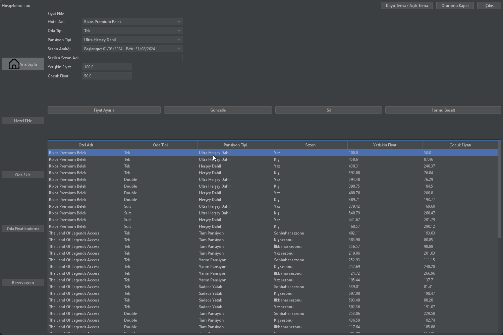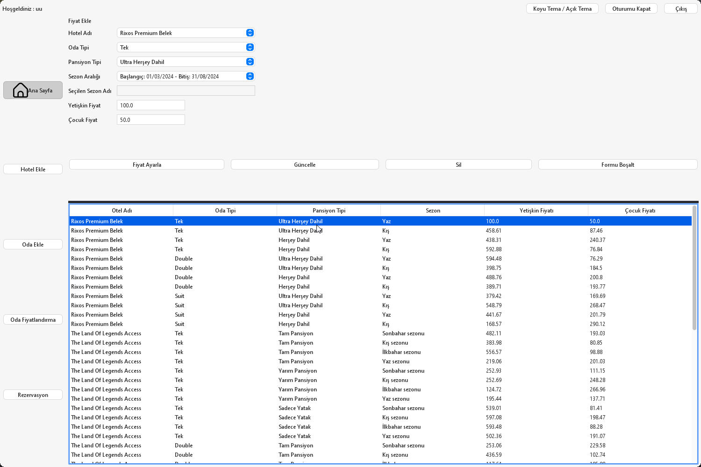

*Reservation Panel*

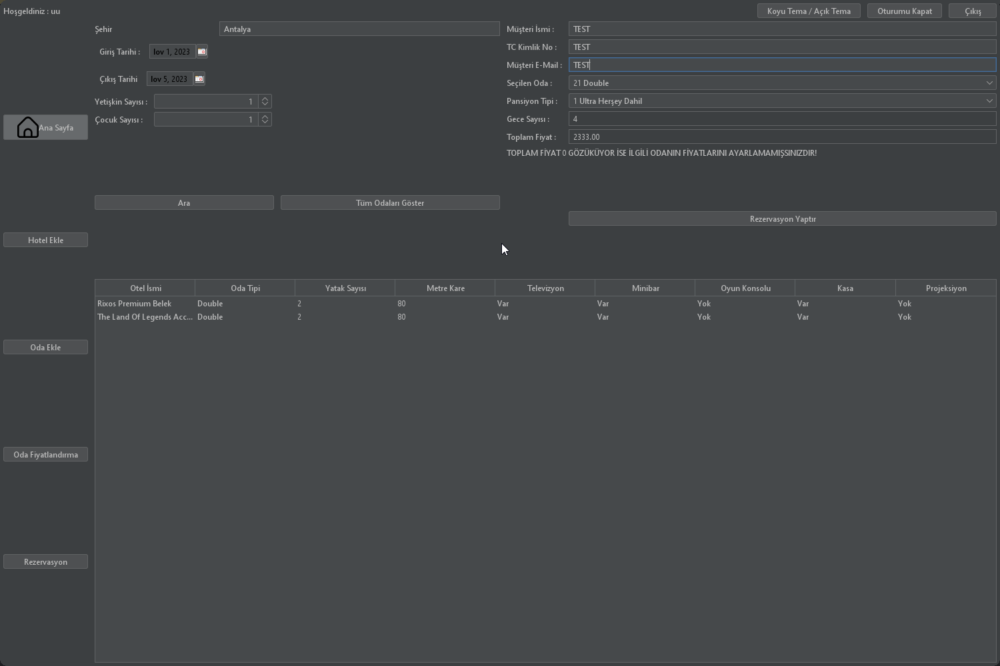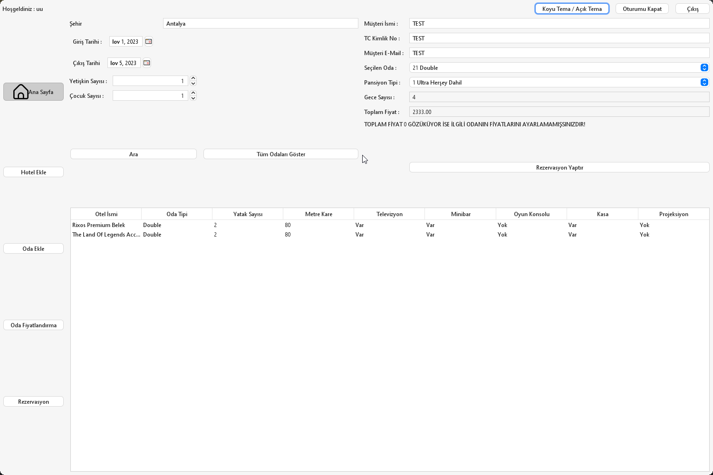

*DB Diyagramı*

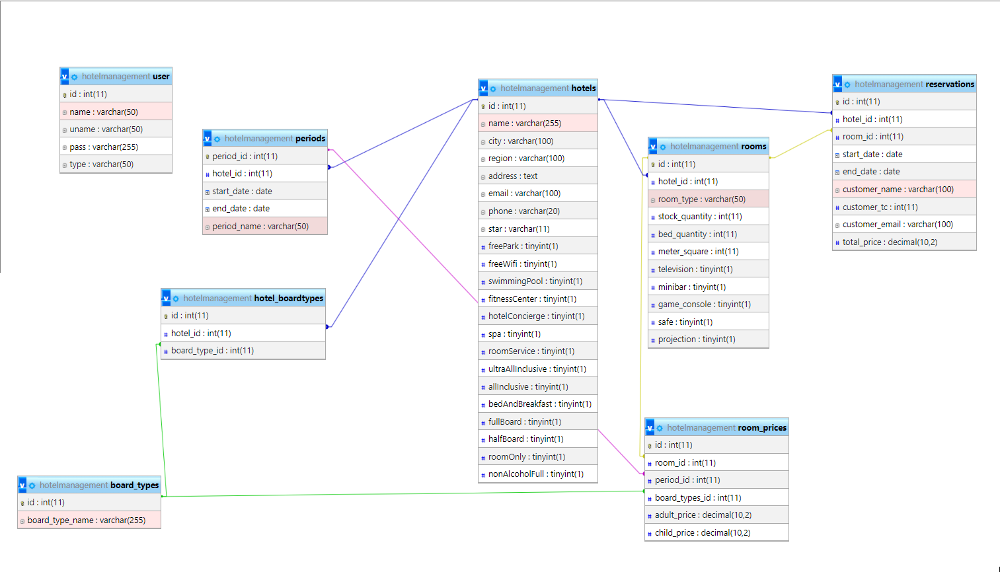

# Project Tables

## Board Type Table

### Table Creation
```sql
CREATE TABLE `board_types`(
    `id`              int(11) NOT NULL,
    `board_type_name` varchar(255) NOT NULL,
    PRIMARY KEY (`id`)
) ENGINE=InnoDB DEFAULT CHARSET=utf8mb4 COLLATE=utf8mb4_general_ci;
```
### Sample Data Insertion for Hotel Table
```sql
INSERT INTO `board_types` (`id`, `board_type_name`)
VALUES (1, 'Ultra Herşey Dahil'),
       (2, 'Herşey Dahil'),
       (3, 'Oda Kahvaltı'),
       (4, 'Tam Pansiyon'),
       (5, 'Yarım Pansiyon'),
       (6, 'Sadece Yatak'),
       (7, 'Alkol Hariç Full credit')

```

## Hotel Table

### Table Creation
```sql
CREATE TABLE `hotels` (
  `id` int(11) NOT NULL,
  `name` varchar(255) NOT NULL,
  `city` varchar(100) NOT NULL,
  `region` varchar(100) DEFAULT NULL,
  `address` text DEFAULT NULL,
  `email` varchar(100) DEFAULT NULL,
  `phone` varchar(20) DEFAULT NULL,
  `star` varchar(11) DEFAULT NULL,
  `freePark` tinyint(1) NOT NULL,
  `freeWifi` tinyint(1) NOT NULL,
  `swimmingPool` tinyint(1) NOT NULL,
  `fitnessCenter` tinyint(1) NOT NULL,
  `hotelConcierge` tinyint(1) NOT NULL,
  `spa` tinyint(1) NOT NULL,
  `roomService` tinyint(1) NOT NULL,
  `ultraAllInclusive` tinyint(1) NOT NULL,
  `allInclusive` tinyint(1) NOT NULL,
  `bedAndBreakfast` tinyint(1) NOT NULL,
  `fullBoard` tinyint(1) NOT NULL,
  `halfBoard` tinyint(1) NOT NULL,
  `roomOnly` tinyint(1) NOT NULL,
  `nonAlcoholFull` tinyint(1) NOT NULL,
   PRIMARY KEY (`id`) 
) ENGINE=InnoDB DEFAULT CHARSET=utf8mb4 COLLATE=utf8mb4_general_ci;
```
### Sample Data Insertion for Hotel Table
```sql
INSERT INTO `hotels` (`id`, `name`, `city`, `region`, `address`, `email`, `phone`, `star`, `freePark`, `freeWifi`,
                      `swimmingPool`, `fitnessCenter`, `hotelConcierge`, `spa`, `roomService`, `ultraAllInclusive`,
                      `allInclusive`, `bedAndBreakfast`, `fullBoard`, `halfBoard`, `roomOnly`, `nonAlcoholFull`)
VALUES (1, 'Rixos Premium Belek', 'Antalya', 'Belek', 'Belek, Ileribaşı Mevkii, 07500 Serik/Antalya', 'rixos@rixos.com',
        '02427102000', '7', 1, 1, 1, 1, 1, 1, 1, 1, 1, 0, 0, 0, 0, 0),
       (2, 'The Land Of Legends Access', 'Antalya', 'Belek', 'Belek, Ileribaşı Mevkii, 07500 Serik/Antalya',
        'rixos.com', '46656564', '5', 1, 1, 1, 1, 0, 0, 1, 0, 0, 0, 1, 1, 1, 0),
       (3, 'Grand Hyatt Istanbul', 'Istanbul', 'Sisli',
        'Harbiye Mahallesi, Taskisla Caddesi No:1, Sisli, 34367 Istanbul', 'grandhyattistanbul@hyatt.com',
        '02123301234', '3', 1, 1, 0, 0, 1, 0, 1, 0, 1, 1, 0, 0, 0, 0),
       (4, 'Four Seasons Hotel Istanbul', 'Istanbul', 'Besiktas', 'Ciragan Caddesi No:28, Besiktas, 34349 Istanbul',
        'fourseasonsistanbul@fourseasons.com', '02123102030', '2', 1, 1, 1, 0, 0, 0, 1, 0, 0, 0, 0, 0, 1, 0);
```
## Hotel Board Types Table

### Table Creation
```sql
CREATE TABLE `hotel_boardtypes`
(
    `id`            int(11) NOT NULL,
    `hotel_id`      int(11) DEFAULT NULL,
    `board_type_id` int(11) NOT NULL,
     PRIMARY KEY (`id`),
     FOREIGN KEY (`hotel_id`) REFERENCES `hotels` (`id`) ON DELETE CASCADE ON UPDATE CASCADE,
     FOREIGN KEY (`board_type_id`) REFERENCES `board_types` (`id`) ON DELETE CASCADE ON UPDATE CASCADE
) ENGINE=InnoDB DEFAULT CHARSET=utf8mb4 COLLATE=utf8mb4_general_ci;
```
### Sample Data Insertion for Hotel Board Type Table
```sql
INSERT INTO `hotel_boardtypes` (`id`, `hotel_id`, `board_type_id`)
VALUES (1, 1, 1),
       (2, 1, 2),
       (8, 2, 4),
       (9, 2, 5),
       (10, 2, 6),
       (19, 3, 1),
       (20, 3, 3),
       (21, 4, 6);
```
## Periods Table

### Table Creation
```sql
CREATE TABLE `periods`
(
    `period_id`  int(11) NOT NULL,
    `hotel_id`   int(11) DEFAULT NULL,
    `start_date` date NOT NULL,
    `end_date`   date NOT NULL,
    PRIMARY KEY (`period_id`),
    CONSTRAINT `periods_ibfk_1` FOREIGN KEY (`hotel_id`) REFERENCES `hotels` (`id`) ON DELETE CASCADE ON UPDATE CASCADE
) ENGINE=InnoDB DEFAULT CHARSET=utf8mb4 COLLATE=utf8mb4_general_ci;

```
### Sample Data Insertion for Pediods Table
```sql
INSERT INTO `periods` (`period_id`, `hotel_id`, `start_date`, `end_date`, `period_name`)
VALUES (1, 1, '2024-03-01', '2024-08-31', 'Yaz'),
       (2, 1, '2023-09-01', '2024-02-28', 'Kış'),
       (19, 2, '2023-09-01', '2023-11-30', 'Sonbahar sezonu'),
       (20, 2, '2023-12-01', '2024-02-28', 'Kış sezonu'),
       (21, 2, '2024-03-01', '2024-05-31', 'İlkbahar sezonu'),
       (22, 2, '2024-06-01', '2024-08-31', 'Yaz sezonu'),
       (23, 3, '2023-09-01', '2024-02-28', 'Kış'),
       (24, 3, '2024-03-01', '2024-08-31', 'Yaz'),
       (25, 4, '2023-09-01', '2023-11-30', 'Sonbahar sezonu'),
       (26, 4, '2023-12-01', '2024-02-28', 'Kış sezonu'),
       (27, 4, '2024-03-01', '2024-05-31', 'İlkbahar sezonu'),
       (28, 4, '2024-06-01', '2024-08-31', 'Yaz sezonu');
```
## Room Table

### Table Creation
```sql
CREATE TABLE `rooms`
(
    `id`             int(11) NOT NULL,
    `hotel_id`       int(11) DEFAULT NULL,
    `room_number`    varchar(100) NOT NULL,
    `room_type`      varchar(50) DEFAULT NULL,
    `stock_quantity` int(11) NOT NULL,
    `bed_quantity`   int(11) NOT NULL,
    `meter_square`   int(11) NOT NULL,
    `television`     tinyint(1) NOT NULL,
    `minibar`        tinyint(1) NOT NULL,
    `game_console`   tinyint(1) NOT NULL,
    `safe`           tinyint(1) NOT NULL,
    `projection`     tinyint(1) NOT NULL,
    `board_type_id`  int(11) DEFAULT NULL,
    PRIMARY KEY (`id`),
    KEY `rooms_ibfk_1` (`hotel_id`),
    KEY `rooms_ibfk_2` (`board_type_id`),
    CONSTRAINT `rooms_ibfk_1` FOREIGN KEY (`hotel_id`) REFERENCES `hotels` (`id`) ON DELETE CASCADE ON UPDATE CASCADE,
    CONSTRAINT `rooms_ibfk_2` FOREIGN KEY (`board_type_id`) REFERENCES `board_types` (`id`) ON DELETE CASCADE ON UPDATE CASCADE
) ENGINE=InnoDB DEFAULT CHARSET=utf8mb4 COLLATE=utf8mb4_general_ci;
```
### Sample Data Insertion for Room Table
```sql
INSERT INTO `rooms` (`id`, `hotel_id`, `room_type`, `stock_quantity`, `bed_quantity`, `meter_square`, `television`,
                     `minibar`, `game_console`, `safe`, `projection`)
VALUES (16, 1, 'Tek', 10, 1, 50, 1, 0, 0, 1, 0),
       (21, 1, 'Double', 10, 2, 80, 1, 1, 0, 1, 0),
       (22, 1, 'Suit', 5, 4, 100, 1, 1, 1, 1, 1),
       (23, 2, 'Tek', 10, 1, 50, 1, 0, 0, 1, 0),
       (24, 2, 'Double', 10, 2, 80, 1, 1, 0, 1, 0),
       (25, 3, 'Tek', 10, 1, 50, 1, 0, 0, 1, 0),
       (26, 3, 'Double', 10, 2, 80, 1, 1, 0, 1, 0),
       (27, 3, 'Suit', 5, 4, 100, 1, 1, 1, 1, 1),
       (28, 4, 'Tek', 10, 1, 50, 1, 0, 0, 1, 0);
```
## Room Prices Table

### Table Creation
```sql
CREATE TABLE `room_prices`
(
    `id`            int(11) NOT NULL,
    `room_id`       int(11) DEFAULT NULL,
    `board_type_id` int(11) DEFAULT NULL,
    `period_id`     int(11) DEFAULT NULL,
    `adult_price`   decimal(10, 2) DEFAULT NULL,
    `child_price`   decimal(10, 2) DEFAULT NULL,
    PRIMARY KEY (`id`),
    FOREIGN KEY (`room_id`) REFERENCES `rooms` (`id`) ON DELETE CASCADE ON UPDATE CASCADE,
    FOREIGN KEY (`board_type_id`) REFERENCES `board_types` (`id`) ON DELETE CASCADE ON UPDATE CASCADE,
    FOREIGN KEY (`period_id`) REFERENCES `periods` (`period_id`) ON DELETE CASCADE ON UPDATE CASCADE
) ENGINE=InnoDB DEFAULT CHARSET=utf8mb4 COLLATE=utf8mb4_general_ci;

```
### Sample Data Insertion for Room Prices Table
```sql
INSERT INTO `room_prices` (`id`, `room_id`, `period_id`, `board_types_id`, `adult_price`, `child_price`)
VALUES (1, 16, 1, 1, 557.31, 286.64),
       (2, 21, 1, 1, 594.48, 76.29),
       (3, 22, 1, 1, 379.42, 169.69),
       (4, 16, 2, 1, 458.61, 87.46),
       (5, 21, 2, 1, 398.75, 184.50),
       (6, 22, 2, 1, 548.79, 268.47),
       (7, 16, 1, 2, 438.31, 240.37),
       (8, 21, 1, 2, 488.76, 200.80),
       (9, 22, 1, 2, 441.67, 201.79),
       (10, 16, 2, 2, 592.88, 76.84),
       (11, 21, 2, 2, 389.71, 193.77),
       (12, 22, 2, 2, 168.57, 290.12),
       (47, 23, 19, 4, 482.11, 193.03),
       (48, 23, 20, 4, 383.98, 80.85),
       (49, 23, 21, 4, 556.57, 98.88),
       (50, 23, 22, 4, 219.06, 201.03),
       (51, 24, 19, 4, 253.06, 229.58),
       (52, 24, 20, 4, 436.59, 102.74),
       (53, 24, 21, 4, 117.64, 185.88),
       (54, 24, 22, 4, 405.88, 157.06),
       (55, 23, 19, 5, 252.93, 111.15),
       (56, 23, 20, 5, 252.69, 248.28),
       (57, 23, 21, 5, 124.72, 266.96),
       (58, 23, 22, 5, 195.44, 137.71),
       (59, 24, 19, 5, 190.84, 263.95),
       (60, 24, 20, 5, 467.00, 75.64),
       (61, 24, 21, 5, 255.38, 111.55),
       (62, 24, 22, 5, 249.34, 238.70),
       (63, 23, 19, 6, 539.01, 81.41),
       (64, 23, 20, 6, 597.08, 198.47),
       (65, 23, 21, 6, 593.48, 88.28),
       (66, 23, 22, 6, 502.36, 191.07),
       (67, 24, 19, 6, 303.62, 135.84),
       (68, 24, 20, 6, 347.52, 161.28),
       (69, 24, 21, 6, 470.23, 141.73),
       (70, 24, 22, 6, 406.63, 291.39),
       (93, 28, 25, 6, 117.46, 290.71),
       (94, 28, 26, 6, 454.71, 214.66),
       (95, 28, 27, 6, 182.44, 262.13),
       (96, 28, 28, 6, 473.93, 98.45),
       (97, 25, 23, 1, 538.19, 113.40),
       (98, 26, 23, 1, 419.40, 158.31),
       (99, 27, 23, 1, 224.85, 287.22),
       (100, 25, 24, 1, 597.62, 82.40),
       (101, 26, 24, 1, 431.09, 280.54),
       (102, 27, 24, 1, 412.16, 138.78),
       (103, 25, 23, 3, 551.30, 161.91),
       (104, 26, 23, 3, 365.21, 127.29),
       (105, 27, 23, 3, 577.25, 261.25),
       (106, 25, 24, 3, 280.81, 118.26),
       (107, 26, 24, 3, 240.17, 195.64),
       (108, 27, 24, 3, 135.88, 202.78);

```

## Reservation Table

### Table Creation
```sql
CREATE TABLE `reservations`
(
    `id`             int(11) NOT NULL,
    `hotel_id`       int(11) DEFAULT NULL,
    `room_id`        int(11) DEFAULT NULL,
    `start_date`     date           NOT NULL,
    `end_date`       date           NOT NULL,
    `customer_name`  varchar(100)   NOT NULL,
    `customer_email` varchar(100)   NOT NULL,
    `customer_tc`    int(11) NOT NULL, ,
    `total_price`    decimal(10, 2) NOT NULL,
    PRIMARY KEY (`id`),
    KEY              `reservations_ibfk_1` (`hotel_id`),
    KEY              `reservations_ibfk_2` (`room_id`),
    CONSTRAINT `reservations_ibfk_1` FOREIGN KEY (`hotel_id`) REFERENCES `hotels` (`id`) ON DELETE CASCADE ON UPDATE CASCADE,
    CONSTRAINT `reservations_ibfk_2` FOREIGN KEY (`room_id`) REFERENCES `rooms` (`id`) ON DELETE CASCADE ON UPDATE CASCADE
) ENGINE=InnoDB DEFAULT CHARSET=utf8mb4 COLLATE=utf8mb4_general_ci;
```

## User Table

### Table Creation
```sql
CREATE TABLE `user`
(
    `id`    int(11) NOT NULL,
    `name`  varchar(50)  NOT NULL,
    `uname` varchar(50)  NOT NULL,
    `pass`  varchar(255) NOT NULL,
    `type`  varchar(50)  NOT NULL
) ENGINE=InnoDB DEFAULT CHARSET=utf8mb4 COLLATE=utf8mb4_general_ci;

```
### Sample Data Insertion for User Table
```sql
INSERT INTO `user` (`id`, `name`, `uname`, `pass`, `type`)
VALUES (1, 'Admin', 'Admin', '123', 'Admin'),
       (2, 'User', 'User', '123', 'User');
```

## License

This project is licensed under the MIT License. Refer to the `LICENSE` file for more information.

## Contact

<p align="center">
  <a href="https://github.com/Bpolat0">
    

  <a href="https://discord.com/users/m.batuhanpolat">
    

  <a href="https://www.linkedin.com/in/mehmetbatuhanpolat/">
    
  </a>
</p>

